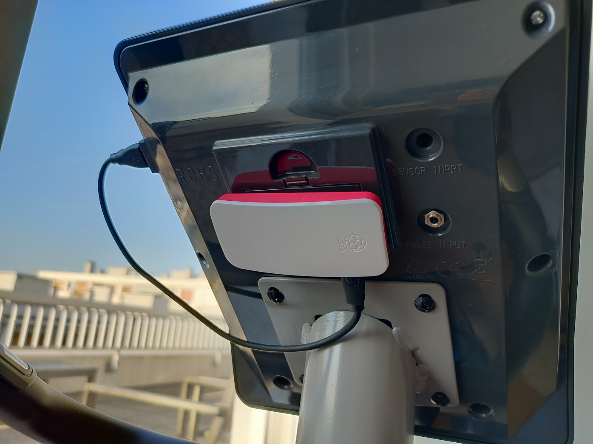
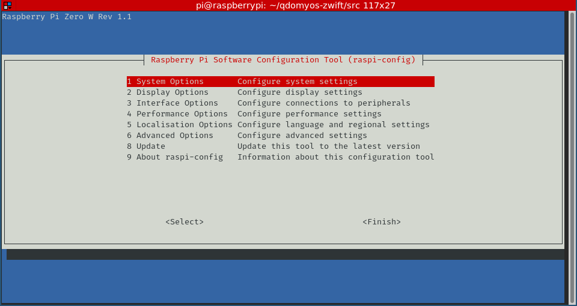

# Installation

QDomyos-Zwift can be installed from source on MacOs, Linux, Android and IOS.

Once you've installed QDomyos-Zwift, you can access the [operation guide](30_usage.md) for more information.

## On a Linux System (from source)

```buildoutcfg
$ sudo apt update && sudo apt upgrade # this is very important on raspberry pi: you need the bluetooth firmware updated!
$ sudo sudo apt install git qt5quickcontrols2-5-dev libqt5bluetooth5 libqt5widgets5 libqt5positioning5 libqt5xml5 qtconnectivity5-dev qtpositioning5-dev libqt5charts5-dev libqt5charts5 qt5-assistant libqt5networkauth5-dev libqt5websockets5-dev qml-module* libqt5texttospeech5-dev libqt5texttospeech5
$ git clone https://github.com/cagnulein/qdomyos-zwift.git
$ cd qdomyos-zwift
$ git submodule update --init src/smtpclient/
$ git submodule update --init src/qmdnsengine/
$ cd src
$ qmake
$ make -j4
$ sudo ./qdomyos-zwift
```


## MacOs installation

You will need to (at a minimum) to install the xcode Command Line Tools (CLI) thanks to @richardwait
https://developer.apple.com/download/more/?=xcode

Download and install http://download.qt.io/official_releases/qt/5.12/5.12.9/qt-opensource-mac-x64-5.12.9.dmg and simply run the qdomyos-zwift relase for MacOs

## On Raspberry Pi Zero W



This guide will walk you through steps to setup an autonomous, headless raspberry brigde.


### Initial System Preparation

You can install a lightweight version of embedded OS to speed up your raspberry booting time.

#### Prepare your SD Card 
Get the latest [Raspberry Pi Imager](https://www.raspberrypi.org/software/) and install, on a SD card, the Raspberry lite OS version.  
Boot on the raspberry (default credentials are pi/raspberry)

#### Change default credentials

`sudo raspi-config` > `Password`

##### Setup Wifi


`sudo raspi-config`
`System Options` > `Wireless LAN`
Enter an SSID and your wifi password.

Your raspberry will fetch a DHCP address at boot time, which can be painful : 
- The IP address might change at every boot
- This process takes approximately 10 seconds at boot time.

It is recommended to set a fixed IP address

#### (optional) Set Fixed IP address 
Edit `/etc/dhcpcd.conf` and insert the following content with your configuration. 

```bash
# Example static IP configuration:
interface wlan0
static ip_address=192.168.1.99/24
static routers=192.168.1.1
static domain_name_servers=192.168.1.1 8.8.8.8 
```

Apply the changes `sudo systemctl restart dhcpcd.service` and ensure you have internet access.

#### Enable SSH access

You might want to access your raspberry remotely while it is attached to your fitness equipement. 

`sudo raspi-config` > `Interface Options` > `SSH`

#### Do not wait for network at boot

This option allows a faster boot. `sudo raspi-config` > `System Options` > `Network at boot` > `No`

#### Reboot and test connectivity 
Reboot your raspberry `sudo reboot now`

Congratulations !  
Your raspberry should be reachable from your local network via SSH.


### QDOMYOS-ZWIFT installation

#### Update your raspberry (mandatory !)

Before installing qdomyos-zwift, let's ensure we have an up-to-date system.

`sudo apt-get update`  
`sudo apt-get upgrade`

This operation takes a moment to complete.

#### Install qdomyos-zwift from sources

`sudo apt install git libqt5bluetooth5 libqt5widgets5 libqt5positioning5 libqt5xml5 qtconnectivity5-dev qtpositioning5-dev libqt5charts5-dev libqt5charts5 qt5-assistant libqt5networkauth5-dev libqt5websockets5-dev`

`git clone https://github.com/cagnulein/qdomyos-zwift.git`  
`cd qdomyos-zwift`  
`git submodule update --init src/smtpclient/`  
`git submodule update --init src/qmdnsengine/`  
`cd src`    
`qmake`    
`make`  

Please note :
- Don't build the application with `-j4` option (this will fail)
- Build operation is circa 45 minutes (subsequent builds are faster)

#### Test your installation 
It is now time to check everything's fine 

`./qdomyos-zwift -no-gui -heart-service`


Test your access from your fitness device. 

#### Automate QDOMYOS-ZWIFT at startup

You might want to have QDOMYOS-ZWIFT to start automatically at boot time. 

Let's create a systemd service that we'll enable at boot sequence.

`sudo vi /lib/systemd/system/qz.service`

```buildoutcfg
[Unit]
Description=qdomyos-zwift service
After=multi-user.target

[Service]
Type=idle  
Restart=always
RestartSec=30
ExecStart=/home/pi/qdomyos-zwift/src/qdomyos-zwift -no-gui -no-log -heart-service
ExecStop=killall -9 qdomyos-zwift
User=root  

[Install]  
WantedBy=multi-user.target 
```

Once your file saved, you need to reload the active systemd configuration.  
`sudo systemctl daemon-reload`

Test your service to check if everything's fine :

`sudo systemctl start qz`


Check if your system is stopping correctly :
`sudo systemctl stop qz`

If everything is working as expected, **enable your service at boot time** :  
`sudo systemctl enable qz`

Then reboot to check operations (`sudo reboot`)


### (optional) Enable overlay FS

Once that everything is working as expected, and if you dedicate your raspeberry pi to this usage, you might want to enable the read-only overlay FS.

By enabling the overlay read-only system, your SD card will be read-only only and every file written will be to RAM.
Then at each reboot the RAM is erased and you'll revert to the initial status of the overlay file-system.

Why doing that ?
- Your SD card will not suffer any write operation and will life longer.
- The risk of corruption of your FS is reduced (in case of unproper shutdown in example)
- This operation is reversible.

**ATTENTION**  
After enabling the overlay filesystem any change on your SDCard will become a temporary change.  
In the case you need to update qdomyos-zwift (in example), you'll need to disable the overlay filesystem first. 

`sudo raspi-config` > `Performance` > `Overlay File system`

"Would you like the overlay filesystem to be enabled ?" YES.

"Would you like the boot partition to be read-only ?" YES.

Reboot immediately.
 

## Other tricks 

I use some [3m magic scratches](https://www.amazon.fr/Command-Languettes-Accrochage-Tableaux-Larges/dp/B00X7792IE/ref=sr_1_5?dchild=1&keywords=accroche+tableau&qid=1616515278&sr=8-5) to attach my raspberry to my bike.
I use the USB port from the bike console (always powered as long as the bike is plugged to main), maximum power is 500mA and this is enough for the raspberry.

You can easily remove the raspberry pi from the bike if required.
